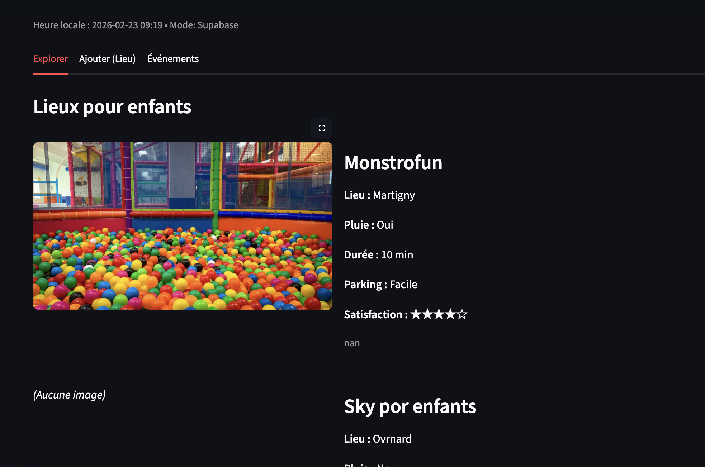

# 🇨🇭 Sorties Famille en Suisse

A simple community app to **share family-friendly places in Switzerland**.

Parents can add places, upload photos, and help other families discover new activities.

Built with **Python + Streamlit**.

---

# 🚀 Live App

👉 Try the app here

[Open the App](https://zitatori-sorties-famille-en-suisse-app-n8xr24.streamlit.app/#sorties-famille-en-suisse)

---

# 📸 Screenshots


## Explore places



---

# ✨ Features

- Add family friendly places
- Upload photos
- Browse places shared by other parents
- Simple interface
- Mobile friendly
- CSV database (simple and portable)
- Optional Supabase storage

---

# 🧠 Why this project

Living in Switzerland with a small child, I realized it's surprisingly hard to find:

- playgrounds
- kid-friendly cafés
- indoor play areas
- weekend activities

So I started building a **community-driven map for parents**.

---

# 🛠 Tech Stack

- Python
- Streamlit
- Pandas
- Supabase (optional)
- Image upload

---

# 📦 Installation

Clone the repository

```bash
git clone https://github.com/Zitatori/Sorties-famille-en-Suisse
cd Sorties-famille-en-Suisse
